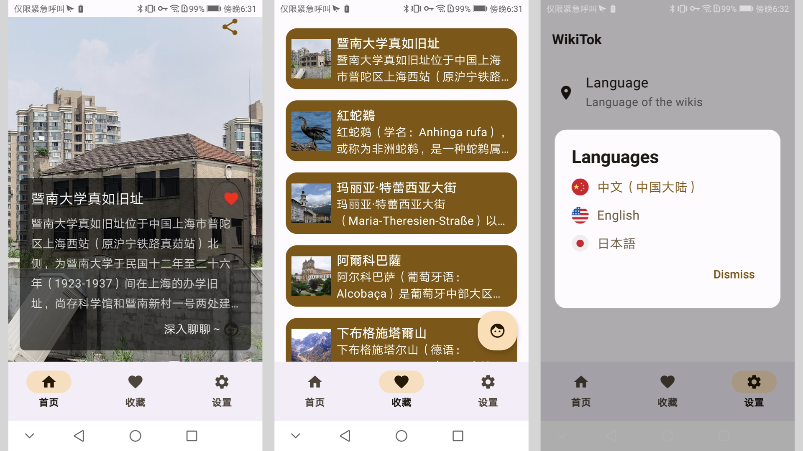
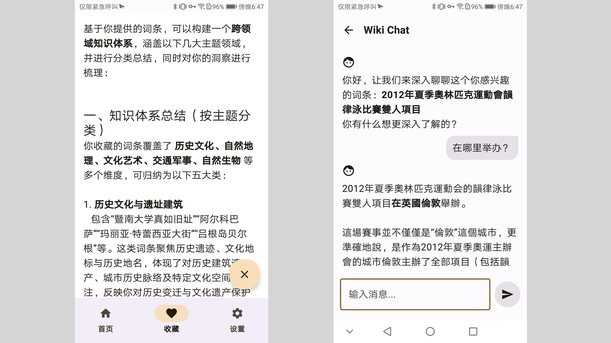

# wikitok-android

Android version of [wikitok](https://github.com/IsaacGemal/wikitok)

A personal project to practice Android development.

## Features

* **TikTok-style vertical feed**: Browse randomly recommended Wikipedia articles with a smooth vertical-scrolling experience.
* **Favorite with double-tap**: Double-tap to add articles to your favorites — stored locally on your device.
* **AI-powered chat**: Talk to an LLM about Wikipedia topics that interest you.
* **Personalized reports**: Get AI-generated summaries based on the content you've saved.

> **Note**:
> This project is intended for learning and experimentation. It doesn't use Firebase, nor does it rely on a self-hosted backend for LLM features.
> To enable AI functionality, you’ll need to provide your own **OpenAI API key** in a `secret.properties` file.

## Tech Stack

* **Ktor** – Networking
* **Coil** – Image loading
* **Koin** – Dependency injection
* **Jetpack Room & DataStore** – Data persistence
* **Jetpack Startup** – App initialization
* **[OpenAI Kotlin SDK (by aallam)](https://github.com/aallam/openai-kotlin/tree/main)** – API client for LLM features


## ScreenShot





## Usage && Development

### 1. Clone the repository

```bash
git clone https://github.com/coreycao/wikitok-android.git
cd wikitok-android
```

### 2. Add your OpenAI API key

Create a file named `secret.properties` in the project's root directory and add your LLM API key

```properties
GENAI_API_KEY=your-gen-ai-api-key
```

> ⚠️ This file is excluded from version control (via `.gitignore`) and is required only for enabling AI-related features.

### 3. Change AI host and modelId

The default AI provider is **SiliconFlow**

You can set your own LLM provider and modelId in the `backend/remote_config.json` file.
